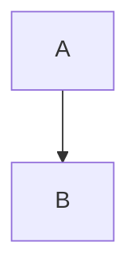

# Markdown Cheatsheet

## Headings

- `# H1` / `## H2` / `### H3`

## Emphasis

- Italic: `*text*` or `_text_`
- Bold: `**text**` or `__text__`
- Bold + Italic: `***text***`

## Lists

- Unordered: `- item` or `* item`
- Ordered: `1. first`\n`2. second`
- Nested: indent by two spaces

## Links & Images

- Link: `[title](https://example.com)`
- Image: ``

## Code

- Inline code: `` `code` ``
- Fenced block:

```lang
code here
```

- Syntax hint: replace `lang` with e.g. `python`, `js`

## Blockquotes

- `> quoted text`
- Nest with additional `>`

## Tables

```
| Col A | Col B |
| --- | --- |
| A1 | B1 |
| A2 | B2 |
```

## Horizontal Rule

- `---` or `***`

## Checkboxes

- `- [ ] todo`
- `- [x] done`

## Line Breaks

- End a line with two spaces

## Escaping

- Prepend `\` to escape special characters: `\*` `\_` `\#`

## Inline HTML

- Allowed in many renderers: `<sup>1</sup>` `<br>`

## Footnotes (if supported)

- `Here is a footnote reference[^1]`\n`[^1]: Footnote text`

## Diagrams (Mermaid, if supported)

````


```
